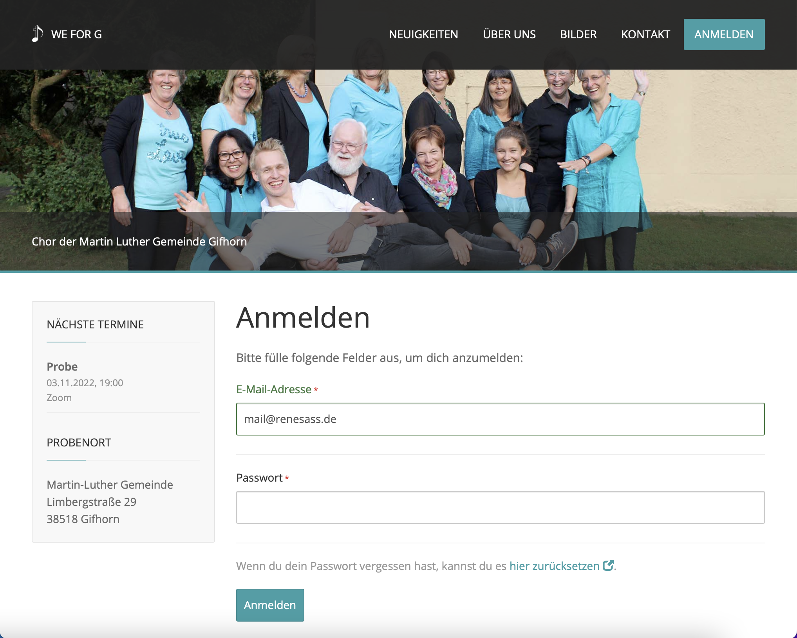

# Content Management System

A content management system written in PHP on Yii2 and sqlite basis. The complete code/design/database structure has 
been designed, planned, and written by me. The project was developed part-time in year 2017.

## Features

- Usersystem with custom profile, groups, and rights
- Static pages with WYSIWYG editor
- Navigation with hierarchy
- Navigationpoints can point to a static page, module or plugin and can be protected (e.g. only logged-in users or users with a specific group associated)
- Global variables: Specify variables, which can be used in code or emails
- Fields: Define fields with different type (checkbox, textfield, date, etc.), assign them to a group, and use it in profile, global variables, or else
- Plugin API
- Appointment plugin
- Gallery plugin
- ... a lot of more details

## Screenshots

### Front

### Admin

